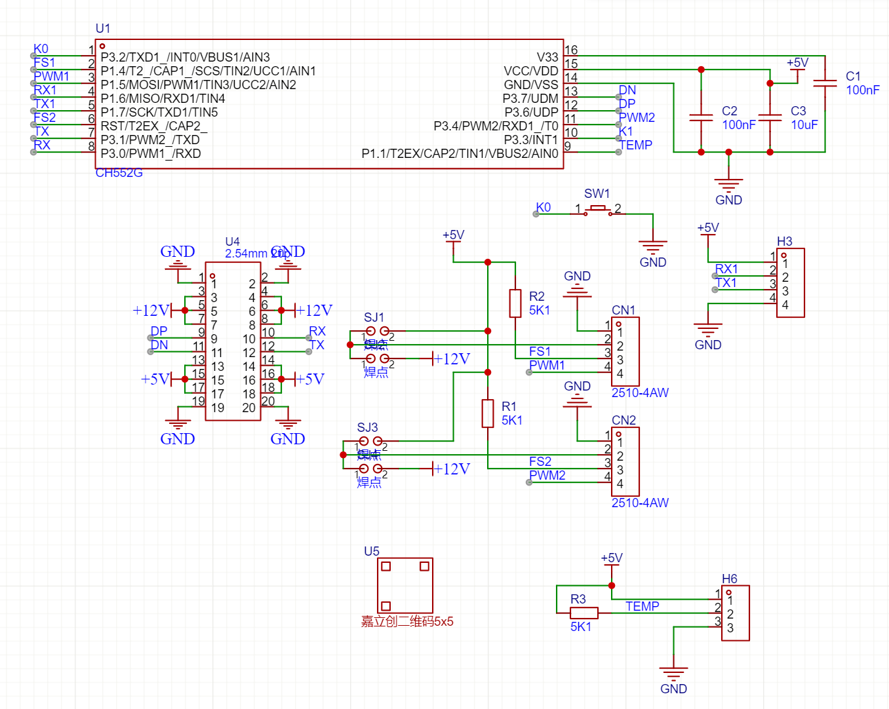

# CH55x 高级风扇控制器

## 简介

CH55x 高级风扇控制器是一款利用 CH551/552/554 实现的 PWM 风扇控制器。主要功能：

- 双路 4 线风扇控制与测速，256 级调速
- USB-CDC / 硬件串口控制台
- 可选单路/双路 DS18B20 温度测量
- 静态 + 16/20 级温控
- 可自定义的 USB 配置信息
- 可控的低波特率 USB 转串口 (CH552+)

## 硬件设计

基于LCEDA设计，总共使用一块 CH55x 和最少 6 个外部元件，由实际验证过的板子导出了[复用图块](./CH55xFanCtl.epro)。




## 软件设计

基于 Keil C51 精心设计的程序，在 CH551 上使用时，需要稍微修剪一下（FLASH 只有 10k，字符串不能太多不然太占代码空间）。

交互上，使用 USB-CDC 串口，通过规定的指令格式交互。指令描述见下。

关于 USB 转低波特率串口 (250Kbps, 8n1): 在 CH552 以上，支持 USB-CDC 转发到串口 1，切换方式为 DTR 有效时通过 RTS 重置，切回来只需在 DTR 无效时重置即可。可参考以下代码逻辑：

```C
                    case SET_CONTROL_LINE_STATE: // 0x22  generates RS-232/V.24 style
                                                 // control signals
#ifndef COMPACT
                        if (UsbSetupBuf->wValueL & 0x1) { // DTR
                            RESET_KEEP |= RSTFLAG_PROXYSERIAL;
                        } else {
                            RESET_KEEP &= ~RSTFLAG_PROXYSERIAL;
                        }
                        if (UsbSetupBuf->wValueL & 0x2) { // RTS
                            EA = 0;
                            SAFE_MOD = 0x55;
                            SAFE_MOD = 0xAA;
                            GLOBAL_CFG |= bSW_RESET; // RESET!
                            EA = 1;
                        }
#endif
```


## 指令总述

指令共分三类，全局指令，全局指令指令，USB 信息指令。
指令可通过控制台输入，每条指令以小于 0x20 的 ASCII 码结束（如换行等），最长输入不超过63 Bytes。参数以空格 ` ` 分隔。

下表中生效时期的解释：`I` = 立即，`R` = 重启后生效，`-` = 无关。
**注意：设备重启后，未保存的更改将会丢失！**

### 全局指令
|         指令         |       用途        | 生效时期 |
| :------------------: | :---------------: | :------: |
|   [/RESET](#reset)   |  立即重启控制器   |    I     |
| [/RESETUP](#resetup) |  重启到升级模式   |    I     |
|   [/ERASE](#erase)   | 擦除/取消擦除配置 |    R     |
| [/console](#console) |  设置控制台参数   |    R     |
|        /help         |     查看帮助      |    -     |
|    [/save](#save)    |     保存配置      |    I     |


### 全局指令
|          指令          |       用途        | 生效时期 |
| :--------------------: | :---------------: | :------: |
|   [/pwmdiv](#pwmdiv)   | 配置 PWM 分频除数 |    I     |
|    [/tscon](#tscon)    |  配置温度传感器   |    I     |
|  [/fanstat](#fanstat)  |   获取风扇状态    |    -     |
| [/fanlevel](#fanlevel) |   设置温控数据    |    I     |
|  [/fanmode](#fanmode)  |   设置风扇模式    |    I     |

### USB 信息
|        指令        |        用途         | 生效时期 |
| :----------------: | :-----------------: | :------: |
|  [/usbid](#usbid)  | 设置 USB VID 和 PID |    R     |
| [/usbman](#usbman) | 设置 USB 制造商信息 |    R     |
| [/usbprd](#usbprd) |  设置 USB 产品信息  |    R     |

### 常用参数名称

| 参数  |  解释   |            限制            |
| :---: | :-----: | :------------------------: |
| fanid | 风扇 ID | 只可取1/2，代表风扇 1 或 2 |
| duty  | 占空比  |        可取 [0,255]        |


## 指令用法说明

### /RESET

立即重启控制器。**未使用 `/save` 保存的更改将丢失！**

### /RESETUP

立即重启控制器到升级模式。随后您可以使用烧录工具更新固件。

### /ERASE

在下一次启动时擦除/取消擦除配置。标记擦除后，重启控制器执行擦除。

### /console

控制台配置，保存重启生效。有如下用途：

| 形式           |                                用途                                 |
| :------------- | :-----------------------------------------------------------------: |
| `/console 0`   |                        设置控制台到硬件串口                         |
| `/console 1`   |                          设置控制台到 USB                           |
| `/console <x>` | 当x >= 150 且 x <= 3600 时，设置硬件串口的波特率。实际波特率为 x*16 |

### /save

将当前配置写入 DataFlash。
控制器启动时，配置信息从 DataFlash 读取到内存，随后通过控制台的所有设置，均只写内存。如果不使用该命令写入，则更改的配置仅当前会话有效，掉电/重启均丢失。

### /pwmdiv


设置 PWM 分频除数。在内部，PWM 经 12M 主频率分频得到，遵循下式：

```
F_pwm = 12 MHz / 256 / pwmdiv
```

有如下用途：

| 形式            |                  用途                  |
| :-------------- | :------------------------------------: |
| `/pwmdiv`       |         获取当前 PWM 分频除数          |
| `/pwmdiv <div>` | 设置 PWM 分频除数。该值须在 [1,255] 内 |

### /tscon

配置温度传感器。配套的温度传感器为 DS18B20，通过 OneWire 连接，可并联。用途如下：

| 形式                  |                                                                      用途                                                                       |
| :-------------------- | :---------------------------------------------------------------------------------------------------------------------------------------------: |
| `/tscon <fanid>`      |                                                 获取 `fanid` 对应传感器的状态。返回 `<en>[,id]`                                                 |
| `/tscon <fanid> <en>` | 设置 `fanid` 对应的传感器状态。en 可取 0 或非 0 任意值，0为关闭。 设置为开启时，请确保总线上只有一个传感器，控制器将读取传感器 64位 ID 并记录。 |

**提示：可以只开启一个风扇的温度传感器，此时该传感器全局共用。**

### /fanstat

获取风扇状态。需要传入 `fanid`。返回数据形如：

```
T = <t>, N = <n>, F = <f>
```
其中：
- `t`: 温度传感器原始值，UINT16
- `n`: 当前 PWM 占空比级别
- `f`: 反馈的风扇转速，单位是 RPS

### /fanlevel

配置温控风扇数据。仅传入 `fanid` 时可获取当前配置。

当探测到的温度低于 0 时，使用最低级的设置值；大于 127.5 时，采用最高级的设置值。
其他情况，寻找温度对应的最高级数，并采用其值。

对于写入，遵循如下指令格式：

```
/fanlevel <fanid> <level> <bound> <duty>
```

- `level`: 级数，对于指定的风扇不启用温度传感器的情形，可达 20 级(0~19)，否则为 16 级(0~15)
- `bound`: 温度下界，采用定点 7.1 格式分辨率到 0.5 摄氏度，均取正值。此处期望一个正整数
- `duty`:  PWM 占空比值，实际占空比为 `duty/255 * 100%`

### /fanmode

配置风扇模式。用途如下：


| 形式                        |           用途           |
| :-------------------------- | :----------------------: |
| `/fanmode <fanid>`          |     获取对应风扇模式     |
| `/fanmode <fanid> 0`        |       关闭风扇输出       |
| `/fanmode <fanid> 1 <duty>` | 设置风扇为静态占空比模式 |
| `/fanmode <fanid> 2 `       |    设置风扇为温控模式    |

### /usbid

设置 USB 的 VID 和 PID。接受两个 UINT16 整数，分别表示 VID 和 PID。

### /usbman

设置 USB 制造商字符串描述符。指令格式：

```
/usbman <opt> <hexstring>
```

- `opt`：字符串扩展标记，取 1 时，源字符串每位作 0 扩展到 UTF16-LE。适用于英文字符串。
- `hexstring`: Hex 编码的字符串原始数据。原始数据最长 10 Bytes。

### /usbprd

设置 USB 产品字符串描述符。指令格式：

```
/usbprd <opt> <hexstring>
```

- `opt`：字符串扩展标记，取 1 时，源字符串每位作 0 扩展到 UTF16-LE。适用于英文字符串。
- `hexstring`: Hex 编码的字符串原始数据。原始数据最长 20 Bytes。


## 许可与声明

一些代码由 WCH 的例程提供，耦合度较大，修改的部分未能显式标注，敬请见谅。

项目在 BSD-3 下开源，详见 LICENSE。